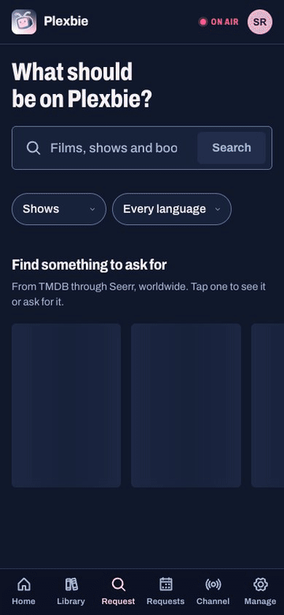
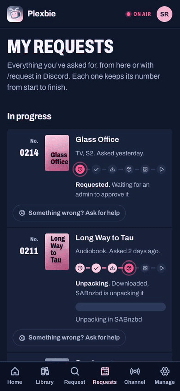
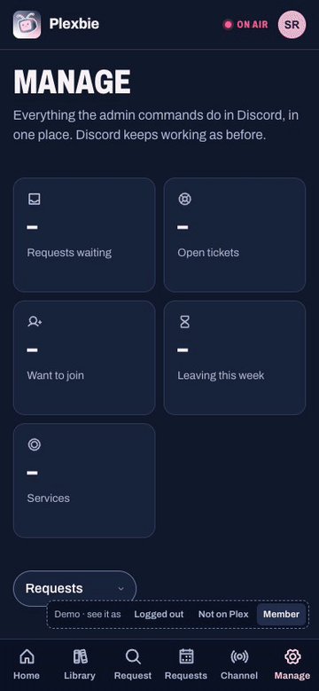
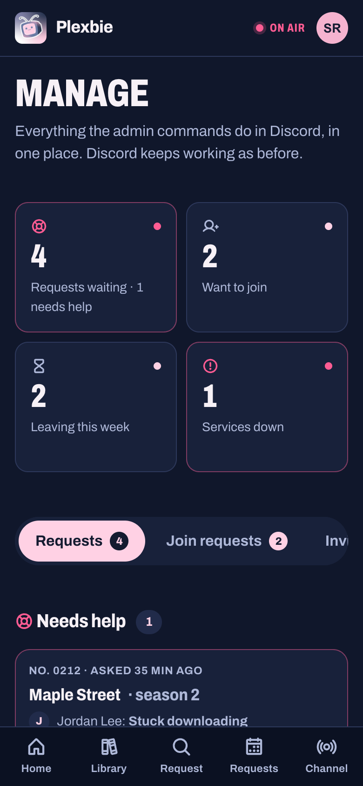
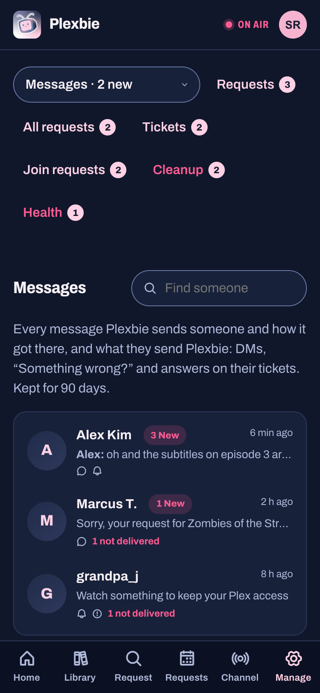
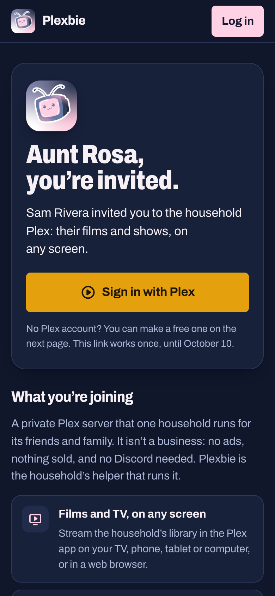
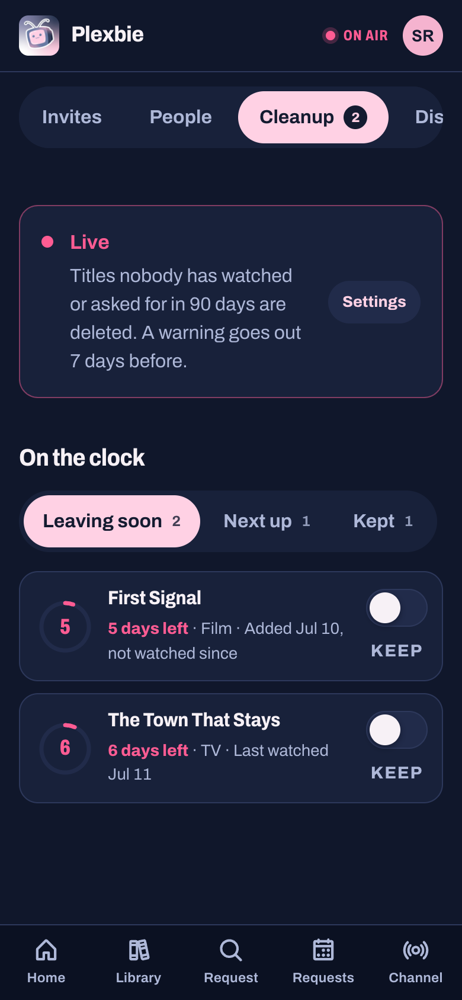

<p align="center">
  
</p>

<h1 align="center">Plexbie</h1>

<p align="center">
  <b>Your household’s Plex, on air.</b><br>
  A Discord bot and a website that look after a home Plex server: requests, invites,<br>
  who’s watching, and all the quiet housekeeping in between.
</p>

<p align="center">
  <a href="https://github.com/NovaOra/plexbie/actions/workflows/tests.yml"></a>
  
  
  <a href="LICENSE"></a>
  <a href="https://ko-fi.com/novaora"></a>
</p>

<p align="center">
  <a href="#tonights-line-up">Features</a> ·
  <a href="#see-it-in-action">See it in action</a> ·
  <a href="#the-website-built-in">The website</a> ·
  <a href="#eleven-plugins-keep-the-ones-you-like">Plugins</a> ·
  <a href="#on-air-in-six-commands">Get started</a> ·
  <a href="https://plexbie.com">plexbie.com</a> ·
  <a href="#support-plexbies-development">Support its development</a>
</p>

https://github.com/user-attachments/assets/b5409525-02c4-48ea-bc10-70a2202e68a6

<p align="center"><sub>A 73-second look, made with invented titles and people. For the full three-minute tour, tune to channel 05 on <a href="https://plexbie.com">plexbie.com</a>.</sub></p>

---

## Tonight’s line-up

Plexbie is built like a TV schedule: four channels, each doing one job well, and every one of them reachable from
Discord *or* from the website.

<table>
  <tr>
    <td width="50%" valign="top">
      <h3>Requests</h3>
      <b>Ask for it, follow it.</b> Shows, films, audiobooks and ebooks, season by season. One admin approval queue,
      then live progress all the way from searching to downloading, unpacking and <i>On Plex</i>.
    </td>
    <td width="50%" valign="top">
      <h3>Plex access</h3>
      <b>Invites, minus the chores.</b> <code>/join-plex</code> and one Approve button, or a single-use invite link
      for family who don’t use Discord. Accounts stay linked even when the names differ.
    </td>
  </tr>
  <tr>
    <td width="50%" valign="top">
      <h3>Watching</h3>
      <b>Who’s watching what.</b> A self-updating now-playing board, an all-time leaderboard, daily streaks, and
      watch-party credit for Discord Go Live.
    </td>
    <td width="50%" valign="top">
      <h3>Housekeeping</h3>
      <b>The quiet jobs, done.</b> Arrival announcements, a 90-day countdown on unwatched media (with a practice
      mode), books filed into a library, inactivity reminders, and service health alerts.
    </td>
  </tr>
</table>

## See it in action

<table>
  <tr>
    <td align="center" width="33%"><br><b>Ask for it</b><br><sub>Search as you type, see which seasons are already on Plex, pick the rest.</sub></td>
    <td align="center" width="33%"><br><b>Follow it</b><br><sub>Live SABnzbd progress, Unpacking, Adding to Plex, then <i>On Plex</i>.</sub></td>
    <td align="center" width="33%"><br><b>Decide it</b><br><sub>Swipe right to approve, hold to decline. Discord’s card updates too.</sub></td>
  </tr>
</table>

<p align="center"><sub><b>All made up.</b> Every title, cover, name and message in the video, these recordings and the screenshots below comes from Plexbie’s demo mode. None of it is a real library, household or person.</sub></p>

## The website, built in

The bot serves its own website from the same container, on port 7979 out of the box. Members sign in with
**Discord or Plex**; admins get a **Manage** page that does everything the Discord admin commands do.

<table>
  <tr>
    <td align="center" width="25%"><br><sub><b>Manage</b>, at a glance</sub></td>
    <td align="center" width="25%"><br><sub><b>Messages</b>, Discord style</sub></td>
    <td align="center" width="25%"><br><sub><b>Invite links</b> for family</sub></td>
    <td align="center" width="25%"><br><sub><b>Cleanup</b>, from your phone</sub></td>
  </tr>
</table>

- **Requests that tell you what’s happening:** live SABnzbd progress, an *Unpacking* step, and season-by-season
  status so people can ask for the seasons that are still missing.
- **Trending right now:** the top 15 films and shows this week, with *On Plex* on anything you already have.
- **Something wrong? Ask for help:** a member flags a stuck request and the admins get the details, plus
  *Search again* and *Resolve*, on Discord and the website.
- **No Discord? No problem:** invite links, Sign in with Plex, and phone alerts (or email) for everything Discord
  members are DMed, including the heads-up before an account would lapse.
- **Phone first:** installable, tactile (swipe to approve, hold to confirm), and checked for accessibility.

## Eleven plugins. Keep the ones you like.

Every feature lives in its own folder under `plugins/`, declares itself in a `plugin.json`, and can be switched off
without touching anything else.

| Plugin | What it does |
|---|---|
| `user_invites` | `/join-plex` and the approval flow |
| `user_mgmt` | Account linking, inactivity tracking, removal |
| `media_requests` | `/request` for TV, film, audiobook and ebook |
| `media_cleanup` | Report and optionally delete unwatched media |
| `new_media_added` | Announce additions from Plex webhooks |
| `watch_tracking` | Now watching, leaderboard and streaks |
| `watch_party` | Watch credit for Discord Go Live streams |
| `bookshelf_processor` | File audiobooks and ebooks into a library |
| `service_health` | Probe Plex and Tautulli, alert on failure |
| `status` | `/say`, a message from Plexbie in any channel (admins) |
| `invite_tracker` | Who invited whom to the Discord server |

## On air in six commands

You’ll need Docker, a Discord bot token, and a Plex server with its token. Sonarr, Radarr, Seerr, Tautulli and
SABnzbd are optional and add more features. Use it with media you own or are entitled to use.

```bash
git clone https://github.com/NovaOra/plexbie.git
cd plexbie
cp config/.env.example config/.env
# fill in DISCORD_BOT_TOKEN, GUILD_ID, PLEX_URL and PLEX_TOKEN
docker build -t plexbie:latest .
docker compose up -d
```

Then open **http://&lt;your host&gt;:7979** and sign in with the Plex account that owns the server: you’re the admin.
The details are below.

---

## Contents

- [What it does](#what-it-does)
- [Requirements](#requirements)
- [Quick start](#quick-start)
- [Configuration](#configuration)
- [Commands](#commands)
- [Web portal](#web-portal)
- [Webhooks](#webhooks)
- [Plugins](#plugins)
- [Architecture](#architecture)
- [Development](#development)
- [Operations](#operations)
- [Security](#security)
- [Limitations](#limitations)

---

## What it does

Plexbie is the front end that ties a home Plex stack together. You already run Plex, Seerr for
requests, Tautulli for watch stats, and probably Sonarr, Radarr and
SABnzbd. Plexbie doesn't replace any of them: it connects them and puts one face on the whole thing, in
Discord and on the website, so your household requests media, gets invited, follows downloads and sees
who's watching from one place instead of five.

**Plex access**

- `/join-plex` collects an email and raises an approval request in an admin
  channel. Approving it invites the account and DMs the user.
- Linked accounts are tracked in a local database, so Discord members and Plex
  accounts stay associated even when the display names differ.
- Accounts are warned after a configurable period of inactivity and removed
  later, with the warning always delivered a full pass before any removal.

**Watching**

- A stats channel carries three self-updating messages: who is watching right
  now, an all-time leaderboard, and daily watch streaks.
- Watch parties: when someone streams Plex over Discord Go Live, everyone in the
  voice channel accrues watch credit, which folds into the leaderboard.

**Media**

- `/request` walks a user through requesting a TV show, film, audiobook or ebook.
- New additions are announced from Plex webhooks, enriched with TMDB metadata,
  and episodes arriving in a batch are collapsed into a single updating message.
- Unwatched media can be reported and, optionally, deleted after a configurable
  period, with an exemption list and a dry-run mode.
- Audiobook and ebook downloads are watched, waited on until they stop changing,
  then renamed and filed into an Audiobookshelf-shaped library.

**Housekeeping**

- Plex and Tautulli are health-checked on a timer, with alerts and recovery
  notices to an admin channel.
- Discord API usage is sampled and logged, per route.
- Invite attribution is recorded, so you can see who brought whom.

---

## Requirements

| | |
|---|---|
| Python | 3.11 |
| Discord | A bot application with the **Server Members** privileged intent |
| Plex | A server plus an auth token |
| Optional | Tautulli, Seerr, a TMDB API key |

**Seerr:** [Seerr](https://github.com/seerr-team/seerr) handles requests (it replaced
Overseerr and Jellyseerr). Set `SEERR_URL` and `SEERR_TOKEN`; **Connect live updates** sets
its webhook up. An `.env` that still says `OVERSEERR_URL` and `OVERSEERR_TOKEN` keeps
working, and Plexbie renames those settings on its next start.

Python dependencies are pinned exactly in `requirements.txt` (and what they pull
in, in `constraints.txt`): `discord.py`, `PlexAPI`, `SQLAlchemy` (asyncio) with
`aiosqlite`, `aiohttp`, `pydantic`, `python-dotenv`, `mutagen`, `pywebpush`.

---

## Quick start

### Docker (recommended)

```bash
git clone https://github.com/NovaOra/plexbie.git
cd plexbie
cp config/.env.example config/.env
```

Fill in `config/.env` — at minimum `DISCORD_BOT_TOKEN`, `GUILD_ID`, `PLEX_URL`
and `PLEX_TOKEN`. Then:

```bash
docker build -t plexbie:latest .
```

The committed `docker-compose.yml` uses relative paths, so it works from a fresh
clone as-is:

```bash
docker compose up -d
docker compose logs -f plexbie
```

The website comes up with it at **http://&lt;your host&gt;:7979**: sign in with the
Plex account that owns the server and you're the admin. It needs no extra setup;
see [Web portal](#web-portal) for putting it on your own domain and adding
"Log in with Discord".

It mounts `./config` (your `.env` and the SQLite database) and `./logs`. The four
media mounts are only needed for the `bookshelf_processor` plugin — point them at
your download client's completed directories and the library you want built, or
delete them if you do not use it.

`network_mode: host` is deliberate: the webhook listener binds to `127.0.0.1` by
default, which only keeps it off the network if the container shares the host's
network namespace. See [Security](#security) if you change this.

### Unraid

Plexbie publishes a ready-made image (`ghcr.io/novaora/plexbie`) and an Unraid template.
There's nothing to edit by hand:

1. In Unraid, **Docker → Template repositories**, add
   `https://github.com/NovaOra/plexbie` and save. (Once Plexbie is listed in Community
   Applications, search "Plexbie" in **Apps** instead.)
2. **Add Container → Plexbie**, keep the defaults and **Apply**.
3. Press **WebUI** (or open `http://<your server>:7979`). The page first asks for the
   **setup code** Plexbie printed in its log (click Plexbie's icon on the Docker tab →
   **Logs**, the line starting `Setup code:`), so only you can set it up. Then it walks
   you through each key, shows where to find it and tests it:
   - your Discord bot: paste the token, then pick your server, channels and roles from lists
   - **Sign in with Plex**
   - optionally Seerr, Sonarr, Radarr, SABnzbd, Tautulli and TMDB
4. Press **Finish**. Plexbie starts and the page turns into the website.

Everything is saved to `appdata/plexbie/config/.env`, which you can still edit later. It
uses host networking: the website is on 7979 and webhooks on `127.0.0.1:7980`. If something
else already uses those ports, change `WEB_PORT` and `WEBHOOK_PORT` in that file. If Discord
later turns the token down, the setup page comes back to ask for a new one, with a new
setup code in the log.

### Without Docker

```bash
python -m venv .venv && source .venv/bin/activate
pip install -r requirements.txt -c constraints.txt
cp config/.env.example config/.env   # then edit it
python -u bot.py
```

The bot reads `config/.env` relative to its working directory, so run it from the
repository root.

### First run

On startup you should see:

```
Plex: Connected to http://...
Plugins: Loaded 11/11 available plugins
Webhook server listening on 127.0.0.1:7980
Commands: 12 synced to guild ...
PLEXBIE DISCORD BOT - READY
```

Slash commands are synced to the guild named by `GUILD_ID`, which takes effect
immediately. If `GUILD_ID` is unset they are registered globally instead, which
can take up to an hour to appear.

---

## Configuration

Everything is read from environment variables, usually via `config/.env`. The
full list lives in `config/.env.example`; this section covers what matters.

### Required

| Variable | Notes |
|---|---|
| `DISCORD_BOT_TOKEN` | Bot token |
| `PLEX_URL` | e.g. `http://192.168.1.50:32400`. Default `http://localhost:32400` |
| `PLEX_TOKEN` | Plex auth token |
| `GUILD_ID` | Without it, commands register globally |

### Strongly recommended

| Variable | Why |
|---|---|
| `BOT_OWNER_ID` | Always counts as an administrator |
| `ADMIN_ROLE_ID` | A role that counts as an administrator |
| `ADMIN_CHANNEL_ID` | Where approval requests and health alerts go |
| `PLEX_USERNAME`, `PLEX_PASSWORD` | Required to *remove* Plex users; invites and reads work without them |

Authorization accepts **any** of: the Discord `administrator` permission, the
`ADMIN_ROLE_ID` role, or `BOT_OWNER_ID`.

### Behaviour

| Variable | Default | Meaning |
|---|---|---|
| `INACTIVITY_WARNING_DAYS` | `25` | Days idle before a warning DM |
| `INACTIVITY_REMOVAL_DAYS` | `30` | Days idle before removal |
| `HEALTH_CHECK_INTERVAL` | `300` | Seconds between service probes |
| `HEALTH_MAX_FAILURES` | `3` | Consecutive failures before alerting |
| `HEALTH_ALERT_COOLDOWN` | `1800` | Seconds between repeat alerts |
| `WATCH_PARTY_CREDIT_INTERVAL` | `300` | Seconds per credit tick |
| `BOOKSHELF_SETTLE_SECONDS` | `120` | How long a download must stop changing before processing |
| `LOG_LEVEL` | `INFO` | |
| `DB_URL` | `sqlite:///config/plexbie.db` | |

> The `@tasks.loop(...)` decorators in the source are **not** the effective
> intervals for the health check or watch party loops — both are overridden from
> config at startup. Read the values above, not the decorators.

### Channels, roles and messages

Many plugins need a channel, role, or the ID of an existing message to keep
updating. Each is optional; the plugin that needs it logs a warning and stands
down if it is missing. The ones you are most likely to want:

`STATS_CHANNEL_ID`, `NOW_WATCHING_MESSAGE_ID`, `LEADERBOARD_MESSAGE_ID`,
`WATCH_STREAK_MESSAGE_ID`, `UPDATES_CHANNEL_ID`, `PLEX_MEMBER_ROLE_ID`,
`WATCH_PARTY_CHANNEL_ID`, `TMDB_API_KEY`.

The three stats messages must already exist — post a placeholder in the channel
and put its ID in the matching variable. The bot only ever edits them; it never
creates them, so it cannot litter the channel if a variable is wrong.

A malformed numeric setting is logged and ignored rather than crashing the bot:

```
Ignoring invalid integer for BOT_OWNER_ID: 'novaora' - expected a numeric ID.
This setting is now INACTIVE.
```

---

## Commands

12 commands are live with the default plugin set (`/cleanup` is one of them, with
five subcommands). **9 are for administrators and hidden from ordinary members**
by Discord itself, so a regular user sees 3. Every command is guild-only and every
reply is ephemeral unless stated otherwise.

### Everyone

| Command | Arguments | Description |
|---|---|---|
| `/join-plex` | | Request access to the Plex server |
| `/request` | | Request a TV show, film, audiobook or ebook |
| `/watchparty-stats` | | Your own watch party credit |

### Administrators

| Command | Arguments | Description |
|---|---|---|
| `/cleanup panel` | | Interactive cleanup control panel |
| `/cleanup config` | `inactivity_days?` `notification_channel?` | Change cleanup thresholds |
| `/cleanup exempt add` | `title` `media_type?` | Never clean up this title |
| `/cleanup exempt remove` | `title` | Drop an exemption |
| `/cleanup exempt list` | | Show the exemption list |
| `/list-plex-users` | `show?` | Plex accounts; `show: Only malformed accounts` filters to those needing removal |
| `/list-tracked-users` | | Database view, flagging accounts no longer on Plex |
| `/manage-links` | | Link or unlink a Discord member and a Plex account |
| `/requests` | | Requests still awaiting a decision, newest first |
| `/remove-user` | `plex_username` | Remove from Plex, notify, and drop the tracking row |
| `/who-invited` | `member` | Who invited this member |
| `/watchparty-active` | | The watch party in progress |
| `/say` | `channel` `message` | Send a message as the bot (logged) |

Admin visibility is enforced twice: `default_member_permissions` keeps the
command out of the picker, and the handler re-checks at runtime. The second check
is the one that matters — a guild administrator can override the first in server
settings.

---

## Web portal

On by default: the bot serves a website on port 7979 (`WEB_PORT`; `0` turns it
off) from the same process and container
(`portal/` for the API, `web/` for the React front end, built into the image),
so the household can do everything above without Discord:

- **Sign in with Discord** (the `identify` scope only) **or with Plex.** A Plex
  sign-in's token is used once and Plexbie then removes itself from that
  account's authorized devices; sessions are a signed cookie holding no tokens.
- **Members:** request films, TV and books through the same admin approval
  cards as `/request`, follow each request with live Sonarr/Radarr/SABnzbd
  progress, see what arrived and what's leaving under the cleanup countdown,
  and turn on phone alerts.
- **Admins (Manage):** approve and decline requests and join requests, make
  invite links, manage people and Discord links, change cleanup settings and
  keep titles forever, post as Plexbie, see who brought whom and the live
  watch party, and check service health. Each command above has its
  counterpart there, and both sides run the same code.
- **Invite links** let someone without Discord join: single use, expiring,
  optionally locked to an email, stored only as a SHA-256. Without one, a Plex
  sign-in cannot ask to join.
- **Members without Discord** are told what Discord members are DMed (request
  decisions, arrivals, inactivity warnings, removal) by phone/browser alerts
  from the site, or by email when `SMTP_*` is set.

**Your address.** The household's Plexbie is the whole site, at the root of its
own address. The usual name is **`plexbie.<your domain>`** (for example
`https://plexbie.example.com`), pointed at port 7979 by your Cloudflare tunnel or
reverse proxy. Setup suggests it from your domain, and **Check this address**
proves it reaches this Plexbie (it fetches a one-time path through the name, the
way a visitor would). Any other name works too: a Tailscale address, a
dynamic-DNS name, or one you already use. Save it as `WEB_PUBLIC_URL`; moved?
List the old one in `WEB_ALIASES` and signed-in phones follow you.

**Logging in with Discord** is optional ("Sign in with Plex" works without it),
and needs three things that must agree:

1. In the [Discord Developer Portal](https://discord.com/developers/applications),
   open your Plexbie app, then **OAuth2**.
2. Under **Redirects**, add your address followed by `/auth/discord/callback`,
   exactly: for `https://plexbie.example.com`, that's
   `https://plexbie.example.com/auth/discord/callback`. Discord compares it
   character for character, so `http` vs `https`, `www.` or a trailing `/` all
   count as different.
3. Copy the **Client Secret** into `DISCORD_CLIENT_SECRET`. The app's ID is
   `DISCORD_CLIENT_ID`, which setup fills in for you.

Plexbie builds the return address from `WEB_PUBLIC_URL`, so it can't drift from
your site. If Discord doesn't list it, Discord refuses the sign-in before it
reaches Plexbie, with "Invalid OAuth2 redirect_uri". **Manage → Health** checks
this for you and names the exact address to add. Without a public address,
`DISCORD_CALLBACK_URL` sets it by hand.

**Changing your address later:**

1. Point the new name at port 7979 in your tunnel or proxy, then press
   **Check this address** in setup.
2. Set `WEB_PUBLIC_URL` to it, and put the old one in `WEB_ALIASES`. Phones that
   signed in through the old address keep working, and the app moves itself over.
3. Add the new `…/auth/discord/callback` under **OAuth2 → Redirects** in the Discord
   Developer Portal. Keep the old one until you've restarted Plexbie.
4. Restart Plexbie. Visitors sign in again once on the new address, because login
   cookies belong to one name.

Plex sign-in needs nothing registered, so it follows the address on its own.

**The phone app** (Android and iPhone, [NovaOra/plexbie-app](https://github.com/NovaOra/plexbie-app)) works
with any Plexbie: members type your address when they sign in.

- **Offering it from your Plexbie:** copy the three files from the app's latest
  GitHub release (`plexbie-<version>.apk`, `plexbie-<version>.ipa` and
  `latest.json`) into `config/app/`. That gives your members:
  - a download card on the website's **Alerts** page, and an update card in the app;
  - one alert to app users per new version;
  - a personal **SideStore/AltStore** source for iPhones. iPhones install the app
    that way, signed with each member's own free Apple ID, so the iPhone app has no
    alerts of its own; members turn on the website's alerts from Safari instead.
- **Alerts:** members turn on the website's alerts (on Android, and on iPhone from
  Safari with the site on the Home Screen), which your install sends itself. The
  app's own alerts go through the Plexbie project's Expo account, so they're off
  unless you set `APP_PUSH=expo`. The app then points members to the website.
- **Links** to your Plexbie open the website, not the app. Signing in returns to the
  app on its own.

**Your pages.** The site's Privacy and Terms name whoever runs it
(`SITE_OPERATOR`, `SITE_CONTACT`), never the Plexbie project. Every page carries
a small "Powered by Plexbie" link to [plexbie.com](https://plexbie.com), the
project's own site, which is separate (`web/project`, served by Cloudflare). The
whole site stays out of search engines; shared links still show a preview card.

---

## Discord permissions

The **Add Plexbie to my server** link on the setup page asks for exactly these, so the bot
doesn't need Administrator:

| Permission | Why |
|---|---|
| View Channels, Send Messages, Embed Links, Read Message History | Every card, board and announcement is an embed; the boards are found again by reading the channel |
| Attach Files | Book covers |
| Manage Messages | Tidying its own admin cards |
| Manage Roles | Handing out Plex Member and New on Plex, and making its roles during setup |
| Manage Channels | **Set up this server for me** makes its category and channels |
| Manage Server | Reading the server's invites, to see who brought whom |
| Create Invite | Invite links for people approved to join |

In Discord's developer portal, the bot also needs the **Server Members** and **Message
Content** intents turned on; the setup page checks both. For handing out roles, Plexbie's own
role must sit above them in Server Settings → Roles. Roles Plexbie creates start out below it.

### Set up this server for me

After you pick your server on the setup page, one button sets it up:

- A **Plexbie** category with these channels:
  - **#new-on-plex**: read-only arrivals, with a "🔔 Ping me for new arrivals" button.
  - **#plex-stats**: read-only, with the three stats boards.
  - **#plexbie-admin**: private, for join requests, approvals, help requests and health alerts.
  - A **Watch Party** voice channel.
- The **Plexbie Admin**, **Plex Member** and **New on Plex** roles.

Every setting is filled in from those. Anything that already exists by those names is reused,
so pressing it again changes nothing. Afterwards, give yourself the Plexbie Admin role to see
#plexbie-admin.

## Webhooks

### Live updates from Seerr and Tautulli

On the setup page, **Connect live updates** on the Seerr and Tautulli cards sets up each
app's webhook through its own API. Nothing needs copying by hand. Connecting gives every webhook
route a secret and opens the listener to your network (`WEBHOOK_BIND=0.0.0.0`).

- **Seerr:**
  - Requests made in Seerr's own site or app become Plexbie requests, with live progress,
    the help button and arrival DMs.
  - Decisions made there reach the requester.
  - A failed download opens a help request for the admins.
- **Tautulli:**
  - Now Watching updates the moment someone presses play.
  - The leaderboard and streaks refresh after a stop.
  - Someone warned for not watching is told they're fine right away.
  - A new viewer is linked at once.
  - Plex going down reaches the admins within seconds.

  Once events arrive, Plexbie checks far less often: Now Watching every minute instead of every
  10 seconds, the boards and account linking hourly instead of every 5 minutes. Those checks stay
  as a safety net.

### Season searches

A season is searched as one release first. When nothing turns up, Plexbie searches the first two
missing episodes on their own. If those are found, it searches the rest episode by episode;
plenty of seasons only exist that way. If even single episodes turn up nothing, a "Can't be
found" help request tells the admins. On the website, **Search episode by episode** on a TV help
request skips straight to that.


An `aiohttp` listener serves these routes:

| Route | Source | Secret |
|---|---|---|
| `POST /webhook/plex` | Plex | `PLEX_WEBHOOK_SECRET` |
| `POST /webhook/sonarr` | Sonarr | `SONARR_WEBHOOK_SECRET` |
| `POST /webhook/radarr` | Radarr | `RADARR_WEBHOOK_SECRET` |
| `POST /webhook/tautulli` | Tautulli | `TAUTULLI_WEBHOOK_SECRET` |
| `POST /webhook/seerr` | Seerr | `SEERR_WEBHOOK_SECRET` |
| `GET /health` | | Liveness probe, no auth |

`WEBHOOK_BIND` defaults to `127.0.0.1` and `WEBHOOK_PORT` to `7980`.

**Every route needs its secret.** A route without one refuses every request,
loopback included (a tunnel or proxy on the same machine forwards strangers from
127.0.0.1 too). Plexbie makes any missing secret when it starts and saves it in
`config/.env`; **Connect live updates** on the setup page hands them to Seerr
and Tautulli.

How each secret is presented differs by what the service can send:

- **Sonarr / Radarr** send `X-Api-Key`; the value must equal the secret.
- **Tautulli** accepts either an `Authorization: Bearer <secret>` header or
  `?secret=<secret>` on the URL.
- **Plex** sends no auth of its own, so append `?token=<secret>` to the webhook
  URL you configure in Plex.
- **Seerr** must send `Authorization`.

Validation **fails closed**: an unrecognised service with a secret configured is
rejected rather than waved through.

---

## Plugins

A plugin is a directory under `plugins/` containing `cog.py` and `plugin.json`:

```json
{
    "name": "my_plugin",
    "version": "1.0.0",
    "description": "What it does",
    "author": "You",
    "enabled": true,
    "dependencies": [],
    "commands": ["/my-command - What it does"]
}
```

`cog.py` must define a class named from the directory in PascalCase plus `Cog`
(`my_plugin` → `MyPluginCog`) taking `(bot, services)`. The loader imports the
module, instantiates that class and registers it — it does **not** call a
`setup()` function, so anything a discord.py extension would put there belongs in
`__init__` or `cog_load` instead.

Persistent views must be registered in `cog_load`, not `setup`.

To turn a plugin off, set `"enabled": false` and restart. Top-level command names
must be unique across **all** plugins, enabled or not; if two collide, one fails
to load and the log names the command.

### Active by default

| Plugin | Purpose |
|---|---|
| `user_invites` | `/join-plex` and the approval flow |
| `user_mgmt` | Account linking, inactivity tracking, removal |
| `media_requests` | `/request` for TV, film, audiobook, ebook |
| `media_cleanup` | Report and optionally delete unwatched media |
| `new_media_added` | Announce additions from Plex webhooks, with TMDB metadata |
| `watch_tracking` | Now Watching, leaderboard and streak displays |
| `watch_party` | Credit for Discord Go Live streams |
| `bookshelf_processor` | File audiobook and ebook downloads into a library |
| `service_health` | Probe Plex and Tautulli, alert on failure |
| `status` | `/say`, a message from Plexbie in any channel (admins) |
| `invite_tracker` | Who invited whom to the Discord server |

---

## Architecture

```
bot.py                 entry point, command sync, global error handling
core/
  services.py          dependency container; shared Plex, HTTP and DB access
  config.py            environment to typed settings
  plugin_manager.py    discovery, load, unload, reload
  permissions.py       is_bot_admin / require_admin / AdminOnlyView
  blocking.py          run_blocking() - the only sanctioned way to call sync I/O
  webhooks.py          aiohttp listener
  webhook_security.py  per-service request validation
  logging.py           JSON logging with size-based rotation
  rate_limit.py        token buckets per external service
  security.py          redaction for logs
database/
  models.py session.py kv_store.py
utils/
  embeds.py formatting.py validators.py
plugins/<name>/        cog.py + plugin.json
webhooks/              Sonarr, Radarr, Seerr and Tautulli webhook handlers
tests/                 over 600 tests, standard library only (plus pywebpush for one)
```

Three conventions matter if you contribute:

**1. Nothing blocking on the event loop.** `plexapi` is entirely synchronous, and
some of its attributes perform HTTP on access — `LibrarySection.totalSize` is a
cached property that issues a request. Wrap a *coarse* unit of work in
`run_blocking()` and return plain data from it; returning a lazy plexapi object
just moves the blocking call back onto the loop. `tests/test_no_blocking_plex_calls.py`
enforces this.

**2. No database transaction across network I/O.** The SQLite database runs in
`delete` journal mode, so a read transaction holds a shared lock for its whole
lifetime and blocks every other writer. Read, close, do the slow work, then write.
`tests/test_efficiency.py` enforces this.

**3. `tasks.loop` stops forever on an unhandled exception.** A loop that watches
something must guard each step, or the first error silently ends the monitoring.

Shared state uses `database/kv_store.py`, a namespaced key-value store with an
atomic upsert. Use `kv_set_many` for more than one key — each `kv_set` is its own
transaction, and a commit on SQLite is an fsync.

---

## Development

```bash
pip install -r requirements-dev.txt -c constraints.txt
python tests/run_all.py                 # everything
python tests/run_all.py config kv       # only matching modules
pytest tests/                           # also works
```

`tests/run_all.py` uses only the standard library, so the suite runs inside the
production image with no dev dependencies:

```bash
docker run --rm -v "$PWD:/src" -w /src -e PYTHONDONTWRITEBYTECODE=1 \
  plexbie:latest python tests/run_all.py
```

The README's GIFs and screenshots come from the website's demo mode (invented
titles, code-drawn covers). To re-record them, run `npm run dev` in `web/`, then
`node scripts/demo-gifs.mjs` (prints the ffmpeg command for the GIFs) and
`node scripts/readme-shots.mjs`.

Over 600 tests. A good number are **pattern tests** rather than
tests of one function: they assert a property of the whole codebase, because
several bugs here recurred by being fixed in one place and missed in its
siblings. Those will fail if you reintroduce the shape:

| Module | Asserts |
|---|---|
| `test_codebase_patterns` | Views are gated; DMs are sent in the right order |
| `test_no_blocking_plex_calls` | Synchronous Plex calls go through `run_blocking` |
| `test_efficiency` | No fetch-then-overwrite, no transaction across network I/O, no per-key bulk writes |
| `test_commands` | Command names are unique, admin commands are hidden, `plugin.json` matches reality |

Tests read the real discord.py objects off each Cog where they can, rather than
parsing source, so they describe what Discord would actually be sent.

---

## Operations

**Logs** are JSON, one object per line, to stdout and `logs/plexbie.log`, rotated
at 20 MB with 5 backups (`LOG_MAX_BYTES`, `LOG_BACKUP_COUNT`).

```bash
docker logs -f plexbie
docker exec plexbie sh -c 'grep "\"level\": \"ERROR\"" /app/logs/plexbie.log | tail'
```

**Health**: `curl http://127.0.0.1:7980/health`

**Deploying a change**: rebuild the image and recreate the container. Tag the
previous image first so there is a way back.

```bash
docker tag plexbie:latest plexbie:rollback
docker build -t plexbie:latest .
docker compose up -d --no-deps --force-recreate plexbie
```

**Stale global commands**: if commands ever appear twice in the picker, they are
registered in both the global and guild scopes and Discord merges the two. The
bot clears the global scope on startup when `GUILD_ID` is set, logging
`removing N stale global command(s)`.

---

## Security

- **The webhook listener binds to loopback by default, and every route needs its
  secret** wherever it listens; missing secrets are made on start.
- **Secrets are compared with `hmac.compare_digest`** on UTF-8 bytes, so a
  non-ASCII secret cannot crash the comparison.
- **Tokens are redacted** from log output, including nested structures.
- **Authorization is checked in the handler**, not inferred from an ephemeral
  reply or from a button being hidden. Persistent views outlive their message and
  re-check on every interaction.
- **Never commit `config/.env`.** It is gitignored, along with `config/*.db` and
  `logs/`.
- `/say` lets an administrator send a message as the bot. Every use is logged
  with the invoking user and target channel. Remove the plugin if you would
  rather not have it.

---

## Limitations

Worth knowing before you rely on this:

- **Single guild.** Commands sync to one `GUILD_ID`, and channel and role
  settings are single-valued. It is not built to be a multi-server bot.
- **SQLite only.** `DB_URL` is passed to SQLAlchemy, but the schema migration and
  the upsert path are written against SQLite. Keep the database off any
  file-syncing tool — syncing a live SQLite file can corrupt it.
- **Removing a Plex user needs `PLEX_USERNAME` and `PLEX_PASSWORD`**, because it
  goes through plex.tv rather than the local server. Without them the bot keeps
  the tracking row and retries, rather than dropping a user it could not remove.
- **Some Plex system accounts cannot be deleted through the API at all.**
  `/list-plex-users show: Only malformed accounts` reports them with manual
  removal steps.
- **Signing in from outside your home needs a public HTTPS address** of your own
  (a reverse proxy or tunnel), such as `plexbie.<your domain>`, for Discord and
  Plex sign-in to come back to. On your home network the website works as it is.

---

## Licence

Copyright © 2026 NovaOra. Licensed under the GNU Affero General Public License,
version 3 or (at your option) any later version: see [LICENSE](LICENSE).

Use it, change it and share it freely. If you share a changed version, or run
one as a website or service for other people, you must make your version's
source code available under the same licence. There is no warranty.

Plexbie uses Plex's, Discord's and TMDB's public APIs under their own terms, and
is not affiliated with or endorsed by Plex, Inc., Discord Inc. or TMDB.


## Contributing

Pull requests are welcome. Please:

1. Run `python tests/run_all.py`; everything should pass.
2. Add a test that fails before your change and passes after.
3. Respect the three conventions in [Architecture](#architecture). The pattern
   tests will tell you if you have not.
4. Explain *why* in comments where the reason is not obvious from the code. Much
   of this codebase carries notes about the failure that motivated a given shape;
   keeping those is more useful than tidying them away.


## Support Plexbie’s development

Plexbie is free, open source (AGPL-3.0), and built by one person in spare evenings. If it
takes some of the admin off your household, you can chip in toward its
development: new features, fixes, keeping up with Plex, Discord and the *arr apps,
and the hours that go into all of it.

- **Ko-fi:** https://ko-fi.com/novaora
- **Buy Me a Coffee:** https://buymeacoffee.com/novaora

Tips support Plexbie, the open-source software, and nothing else. They don’t buy
access to anyone’s Plex server or media, and Plexbie has no paid features: every
part of it is in this repository for anyone to run.
