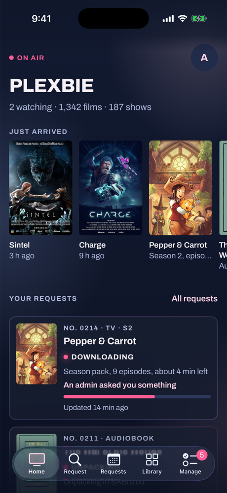
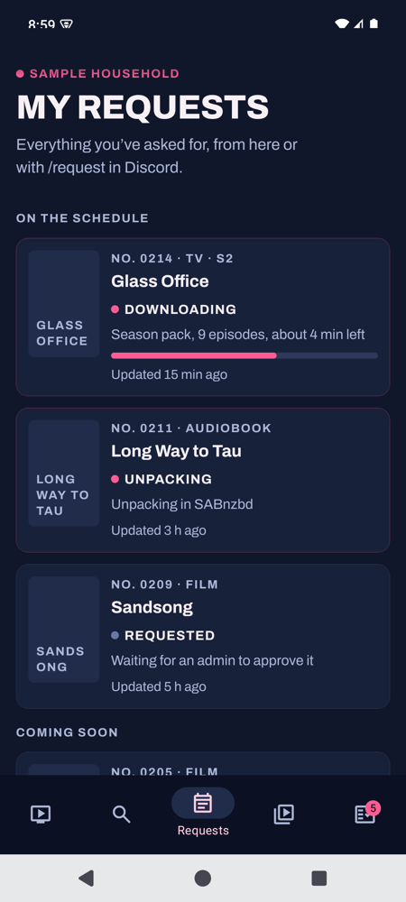
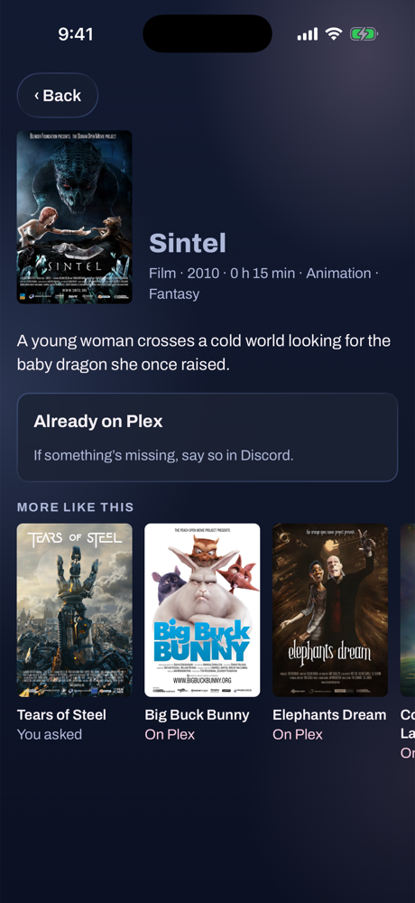
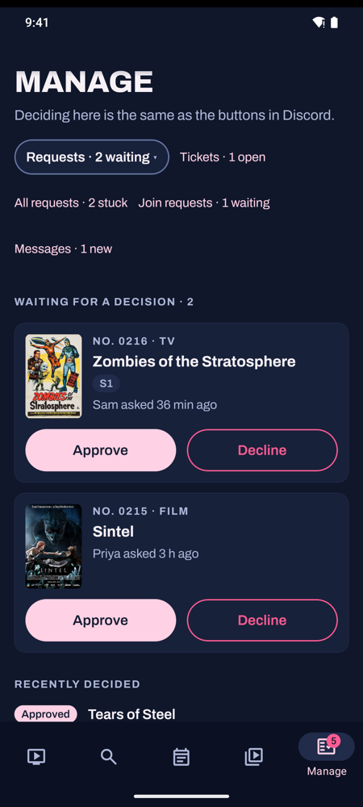

<p align="center">
  
</p>

<h1 align="center">Plexbie</h1>

<p align="center">
  <b>Your household’s Plex, on air.</b><br>
  A Discord bot, a website and a phone app that look after a home Plex server: requests,<br>
  invites, who’s watching, and all the quiet housekeeping in between.
</p>

<p align="center">
  <a href="https://github.com/NovaOra/plexbie/actions/workflows/tests.yml"></a>
  
  
  <a href="LICENSE"></a>
  <a href="https://github.com/sponsors/NovaOra"></a>
</p>

<p align="center">
  <a href="#tonights-line-up">Features</a> ·
  <a href="#see-it-in-action">See it in action</a> ·
  <a href="https://demo.plexbie.com">Demo</a> ·
  <a href="#the-website-built-in">The website</a> ·
  <a href="#in-your-pocket">The app</a> ·
  <a href="#eleven-plugins-keep-the-ones-you-like">Plugins</a> ·
  <a href="#on-air-in-six-commands">Get started</a> ·
  <a href="https://plexbie.com">plexbie.com</a> ·
  <a href="#support-plexbies-development">Support its development</a>
</p>

https://github.com/user-attachments/assets/0cabfb6a-3bb2-4ae9-8d53-c5f07857dffc

<p align="center"><sub>A 73-second look, made with invented titles and people. For the full three-minute tour, tune to channel 02 on <a href="https://plexbie.com">plexbie.com</a>.<br>Music: “Dry and High” by <a href="https://freemusicarchive.org/music/Ketsa/cc-by-free-to-use-for-anything">Ketsa</a> (CC BY 4.0). Sound effects: <a href="https://kenney.nl">Kenney</a> (CC0).</sub></p>

<p align="center"><b><a href="https://demo.plexbie.com">Try the website yourself at demo.plexbie.com</a></b><br><sub>A pretend household: click around as a member, someone not on Plex yet, or logged out. Nothing you do there goes anywhere.</sub></p>

---

## Tonight’s line-up

Plexbie is built like a TV schedule: four channels, each doing one job well, and every one of them reachable from
Discord, the website or the phone app.

<table>
  <tr>
    <td width="50%" valign="top">
      <h3>Requests</h3>
      <b>Ask for it, follow it.</b> Shows, films, audiobooks and ebooks, season by season. One admin approval queue,
      then live progress all the way from searching to downloading, unpacking and <i>On Plex</i>.
    </td>
    <td width="50%" valign="top">
      <h3>Plex access</h3>
      <b>Invites, minus the chores.</b> <code>/join-plex</code> and one Approve button, or a single-use invite link
      for family who don’t use Discord. Accounts stay linked even when the names differ.
    </td>
  </tr>
  <tr>
    <td width="50%" valign="top">
      <h3>Watching</h3>
      <b>Who’s watching what.</b> A self-updating now-playing board, an all-time leaderboard, daily streaks, and
      watch-party credit for Discord Go Live.
    </td>
    <td width="50%" valign="top">
      <h3>Housekeeping</h3>
      <b>The quiet jobs, done.</b> Arrival announcements, a 90-day countdown on unwatched media (with a practice
      mode), books filed into a library, inactivity reminders, and service health alerts.
    </td>
  </tr>
</table>

## See it in action

<table>
  <tr>
    <td align="center" width="33%"><br><b>Ask for it</b><br><sub>Search as you type, see which seasons are already on Plex, pick the rest.</sub></td>
    <td align="center" width="33%"><br><b>Follow it</b><br><sub>Live SABnzbd progress, Unpacking, Adding to Plex, then <i>On Plex</i>.</sub></td>
    <td align="center" width="33%"><br><b>Decide it</b><br><sub>Swipe right to approve, hold to decline. Discord’s card updates too.</sub></td>
  </tr>
</table>

<p align="center"><sub><b>Free to use, every frame.</b> The recordings and screenshots come from Plexbie’s demo mode (the app’s sample household, for the app). Its films, shows and books are real ones that anyone may show: <a href="https://studio.blender.org/films/">Blender Foundation</a> open movies and <a href="https://www.peppercarrot.com">Pepper &amp; Carrot</a> by David Revoy (CC BY), and public-domain films, serials and books, with their own posters and covers. The people, household and messages are made up.</sub></p>

## The website, built in

The bot serves its own website from the same container, on port 7979 out of the box. Members sign in with
**Discord or Plex**; admins get a **Manage** page that does everything the Discord admin commands do.

<table>
  <tr>
    <td align="center" width="25%"><br><sub><b>Manage</b>, at a glance</sub></td>
    <td align="center" width="25%"><br><sub><b>Messages</b>, Discord style</sub></td>
    <td align="center" width="25%"><br><sub><b>Invite links</b> for family</sub></td>
    <td align="center" width="25%"><br><sub><b>Cleanup</b>, from your phone</sub></td>
  </tr>
</table>

- **Requests that tell you what’s happening:** live SABnzbd progress, an *Unpacking* step, and season-by-season
  status so people can ask for the seasons that are still missing.
- **Trending right now:** the top 15 films and shows this week, with *On Plex* on anything you already have.
- **Something wrong? Open a ticket:** a member flags a stuck request on the website, in the app, or with the
  button on Plexbie's approval DM. Admins work it on Manage → Tickets: take it, add notes only admins see,
  reply (the member answers from Discord, the website or the app), search again, and solve it. A reply goes
  as a Discord DM, or as a phone alert or email when their DMs are closed, and Plexbie tells you (and notes on
  the ticket) when it reached nobody, so you can tell them another way.
- **Plexbie's DMs, shared by the admins:** a DM to Plexbie from someone in your household's server alerts the
  admins, lands on Manage → Messages and in its own thread under the admin channel. Answer as Plexbie, signed
  with your name, from the website, the app or Discord.
- **No Discord? No problem:** invite links, Sign in with Plex, and phone alerts (or email) for everything Discord
  members are DMed, including the heads-up before an account would lapse.
- **Phone first:** installable, tactile (swipe to approve, hold to confirm), and checked for accessibility.

## In your pocket

A native app for Android and iPhone, [NovaOra/plexbie-app](https://github.com/NovaOra/plexbie-app). It works
with any Plexbie: members type your address when they sign in, and nothing goes through anyone else’s server.
Requests, their progress, the library and, for admins, the whole Manage page, with Liquid Glass on iOS 26.

<table>
  <tr>
    <td align="center" width="25%"><br><sub><b>Home</b>, iPhone</sub></td>
    <td align="center" width="25%"><br><sub><b>My requests</b>, Android</sub></td>
    <td align="center" width="25%"><br><sub><b>A title</b>, iPhone</sub></td>
    <td align="center" width="25%"><br><sub><b>Manage</b>, Android</sub></td>
  </tr>
</table>

- **Android:** the APK from the app’s releases, or the download card on your Plexbie’s **Alerts** page.
- **iPhone:** through SideStore or AltStore, with each member’s own free Apple ID. Your Plexbie gives every member
  a personal source, so updates arrive there too.
- **Offering it to your household** takes three files in `config/app/`; see [The phone app](#the-phone-app).

## Eleven plugins. Keep the ones you like.

Every feature lives in its own folder under `plugins/`, declares itself in a `plugin.json`, and can be switched off
without touching anything else.

| Plugin | What it does |
|---|---|
| `user_invites` | `/join-plex` and the approval flow |
| `user_mgmt` | Account linking, inactivity tracking, removal |
| `media_requests` | `/request` for TV, film, audiobook and ebook |
| `media_cleanup` | Report and optionally delete unwatched media |
| `new_media_added` | Announce additions from Plex webhooks |
| `watch_tracking` | Now watching, leaderboard and streaks |
| `watch_party` | Watch credit for Discord Go Live streams |
| `bookshelf_processor` | File audiobooks and ebooks into a library |
| `service_health` | Probe Plex and Tautulli, alert on failure |
| `status` | `/say`, a message from Plexbie in any channel (admins) |
| `invite_tracker` | Who invited whom to the Discord server |

## On air in six commands

You’ll need Docker, a Discord bot token, and a Plex server with its token. Sonarr, Radarr, Seerr, Tautulli and
SABnzbd are optional and add more features. Use it with media you own or are entitled to use.

```bash
git clone https://github.com/NovaOra/plexbie.git
cd plexbie
cp config/.env.example config/.env
# fill in DISCORD_BOT_TOKEN, GUILD_ID, PLEX_URL and PLEX_TOKEN
docker build -t plexbie:latest .
docker compose up -d
```

Turn off **Public Bot**: Discord Developer Portal → your app → **Installation** → Install Link: **None** → Save Changes, then **Bot** → turn off Public Bot → Save Changes. Discord refuses the second step while an install link is set. Only you can add Plexbie to a server afterwards, and the setup page's **Add Plexbie to my server** link still works for you.

Then open **http://&lt;your host&gt;:7979** and sign in with the Plex account that owns the server: you’re the admin.
The details are below.

---

## Contents

- [What it does](#what-it-does)
- [Requirements](#requirements)
- [Quick start](#quick-start)
- [Configuration](#configuration)
- [Commands](#commands)
- [Web portal](#web-portal)
- [Webhooks](#webhooks)
- [Plugins](#plugins)
- [Architecture](#architecture)
- [Development](#development)
- [Operations](#operations)
- [Security](#security)
- [Limitations](#limitations)
- [How Plexbie is built (AI use)](#how-plexbie-is-built-ai-use)

---

## What it does

Plexbie is the front end that ties a home Plex stack together. You already run Plex, Seerr for
requests, Tautulli for watch stats, and probably Sonarr, Radarr and
SABnzbd. Plexbie doesn't replace any of them: it connects them and puts one face on the whole thing, in
Discord and on the website, so your household requests media, gets invited, follows downloads and sees
who's watching from one place instead of five.

**Plex access**

- `/join-plex` collects an email and raises an approval request in an admin
  channel. Approving it invites the account and DMs the user.
- Linked accounts are tracked in a local database, so Discord members and Plex
  accounts stay associated even when the display names differ.
- Accounts are warned after a configurable period of inactivity and removed
  later, with the warning always delivered a full pass before any removal.
  The removal takes off the Plex account whose inactivity was measured, never
  whoever an old email or name now points at. Every Tautulli user is read, page by
  page, up to 5,000 (past that the log says so); a name two Tautulli users share (ignoring case) matches neither,
  and the log says so.
- The warning goes by Discord DM; when their DMs are closed (or they have no
  Discord), by phone/browser alert or email instead. If none of those reaches
  them, the admins are told (admin channel and phone alerts; Manage → Messages
  says why each try failed) so they can tell the person themselves or turn on
  Never remove; the removal stays on schedule.
- The Plex server owner is never warned or removed, whether or not their row
  is linked to `BOT_OWNER_ID`. Plexbie learns who the owner is from plex.tv
  (with `PLEX_TOKEN` or `PLEX_USERNAME`/`PLEX_PASSWORD` set), from the Plex
  server, or from an owner's Plex sign-in on the website, and remembers it for
  days when none of those can be asked.
- Two brakes stop the daily check from emptying the server on bad data, and
  each tells the admins (admin channel and phone alerts):
  - if Tautulli hasn't recorded a play by anyone for more than 7 days, its
    history is treated as stale and nobody is warned or removed until plays
    show up again;
  - if one pass would remove more than 3 people, or a quarter of everyone
    tracked when that is more, it removes nobody. Remove them by hand
    (Manage → People or `/remove-user`) if they really are inactive. People
    whose Plex account is already off the share don't count towards this.

**Watching**

- A stats channel carries three self-updating messages: who is watching right
  now, an all-time leaderboard, and daily watch streaks.
- Watch parties: when someone streams Plex over Discord Go Live, everyone in the
  voice channel accrues watch credit, which folds into the leaderboard.

**Media**

- `/request` walks a user through requesting a TV show, film, audiobook or ebook.
  Each request is decided once: an Approve or Decline in Discord for a request
  already decided on the website (or in Seerr) just answers "Already approved"
  or "Already declined" and takes the buttons off the card. A book approval
  that finds nothing on the indexers (or with NZBHydra/SABnzbd not set up)
  sends nothing and leaves the request open, so it can be approved again later.
  A member is told their request was submitted only once its card is in the
  admin channel and the request is saved; if the channel can't be posted to
  (check `ADMIN_CHANNEL_ID` and the bot's permission to send there) or the save
  fails, they're told it didn't go through and no card is left behind. Shows
  are picked season by season, up to 25 seasons per menu (the newest 100 when
  a show has more), with **All Seasons** and, for a running show,
  **Latest + Monitor** as buttons; a show TMDB lists no seasons for yet says so.
- New additions are announced from Plex webhooks, enriched with TMDB metadata,
  and episodes arriving in a batch are collapsed into a single updating message.
  Whoever requested a title is told once it's on Plex (a DM, or a phone alert
  or email for a website request without Discord): a film when it arrives, a
  show when episode 1 of the first season they asked for does, or of any
  season but the specials for **All Seasons**. A film and a show that share a
  TMDB id are tracked apart.
- Unwatched media can be reported and, optionally, deleted after a configurable
  period, with an exemption list and a dry-run mode. A title is deleted through
  Sonarr or Radarr (with its files) and from Plex, found by its TMDB, TheTVDB or
  IMDb id; by name only when exactly one entry has the same title and year and
  none of its ids disagree with Plex's. If Sonarr or Radarr is set up but doesn't
  answer, or has several entries by that name that can't be told apart (or a
  year is missing), the title is kept and tried again at the next daily check.
  Only titles really removed are reported as removed; a manual scan says how
  many were kept. A manual scan (Discord's panel or Manage → Cleanup) is
  refused while cleanup is switched off or another scan is running, and
  switching cleanup off during a scan stops the removals it hasn't reached
  yet. A title in Plex more than once (a 4K library, overlapping folders) shares one
  Sonarr/Radarr entry, so it's judged by all its copies
  with the same id, or the same title and year (Plex has no id for some
  copies): while any copy is watched, exempt or in a skipped library, none is
  removed and no warning is sent for it, and a removal waits until every copy
  is due.
- Cleanup's brakes: a title is removed only once its whole warning has passed,
  `notify_days_before` days (7 by default) counted from the first warning about
  it. So lowering the inactivity days, adding a library or no longer skipping
  one warns first and removes nothing that day; the countdown on the website
  and in the app follows the same rule. (Right after the upgrade that brings
  this in, titles already in the warning window get a full warning again.) A
  title watched, exempted or skipped meanwhile starts over, and so does every
  warning after more than 3 days without a check (Plexbie down, cleanup
  switched off, Plex unreachable). Practice mode keeps the same record: once you
  switch to live, the titles it has been warning about for the whole warning
  period are removed by the next check, within the daily limit below. The daily
  check removes nothing when it would remove more than 5 titles and more than a
  tenth of the titles it looked at: it lists them in the admin channel instead,
  and a manual scan (Discord's panel or Manage → Cleanup) is the go-ahead that
  removes them; a manual scan has no such limit. If Plex's watch history comes
  back empty across more than 50 titles, it's taken as unreadable: nothing is
  removed or warned about that day, the admin channel is told, and the website
  and app show no countdown until someone has watched something.
- Request expiry, part of the same daily check: 90 days after a title's newest
  request, Plexbie turns its monitoring off in Sonarr or Radarr (no new
  episodes or upgrades; no files are touched), and turns it back on when someone
  requests it again. A title exempt from cleanup or in a library cleanup skips,
  or played by anyone in those 90 days, keeps its monitoring, and if Plex can't
  be read nothing is turned off that day. Plexbie only turns back on what it
  turned off itself, so a series you switch off (or back on) by hand stays that
  way. (The first time it runs after an upgrade, it counts every title that is
  already off and whose newest request is over 90 days old as one it turned
  off.) In practice mode it only reports what it would change.
- Audiobook and ebook downloads are watched, waited on until they stop changing,
  then renamed and filed into an Audiobookshelf-shaped library. Each one is
  checked again when its turn comes and once more after its details are looked
  up, before anything is moved: a download that changed meanwhile is left where
  it is and waits out the settle time again. A multi-disc
  release whose tracks share names (`CD1/01.mp3`, `CD2/01.mp3`) is filed as
  `Disc 01 - 01.mp3`, `Disc 02 - 01.mp3`, so no track replaces another. If any
  file can't be moved, everything already moved is put back, the download and
  its request details are kept, and nothing is announced until it files
  completely. A file copied between disks is written as `<name>.plexbie-part`
  and only gets its real name once whole. A book folder holding a hidden
  `.plexbie_incomplete.json` isn't finished (it may already show on the shelf):
  its files couldn't all be put back, or Plexbie stopped part-way, and the next
  attempt moves them back and files the book again into the same folder. If you
  delete that download instead, tidy the folder by hand, marker included.
  The library folders must already exist, set as full paths: Plexbie never
  creates one, since a missing library folder almost always means its volume
  isn't mapped and the books would land inside the container. A blank,
  relative or `/` setting counts as missing too. Finished downloads wait, with
  one error in the log, until it's there. (A mapped folder that is empty
  because the disk behind it isn't mounted looks the same as a new library, so
  check your mappings.) If you don't use the bookshelf, a missing watch folder
  is only noted once, and its library isn't checked. Everything else in a
  download, such as a companion PDF, a booklet or extra artwork, is filed
  beside the book. Junk (`.nfo`, `.sfv`, `.par2`, `.txt`, `.cue` and the
  like), release clutter (archives and their parts, `.srr`, programs,
  `Thumbs.db`) and NAS or macOS metadata folders (`@eaDir`, `.AppleDouble`,
  `__MACOSX`) are deleted with the download. If another file can't be moved,
  the download is kept and logged, and set aside until you change or remove
  it. A download with no book in it is left exactly as it is. An ebook
  download holding several different books (a pack of a series) isn't filed
  as one book: it's logged and left for you to file by hand, or to move each
  book into the watch folder on its own. It counts as several books when two
  files of one format have names that don't contain each other, or the same
  name in folders numbered differently (`Book 1`, `Book 2`). Files named as
  extras (sample, excerpt, errata, preview, appendix, bonus and the like)
  never count as another book, but any other pair, such as `Book.pdf` and
  `Maps.pdf`, is left for you to file. A pack whose titles contain one another
  (`Dune`, `Dune Messiah`) is filed as one book. Audiobook files are the formats
  Audiobookshelf plays (mp3, m4a, m4b, aac, flac, ogg, oga, opus, wav, aiff,
  mka, wma, mp4, webm and a few more) plus ape; ebooks are epub, pdf, mobi,
  azw, azw3, kfx, cbz, cbr, djvu, fb2, lit and rtf.
  Request details (who asked, title, cover) come only from the hidden
  `.plexbie_hint_*.json` Plexbie writes beside the download when it sends a
  request; nothing inside a download is taken as request details. Cover art is
  fetched only from public http(s) hosts, never from an address on your network
  (redirects included), and only a JPEG, PNG or WebP image of up to 15 MB is
  saved as `cover.jpg` or cached.

**Housekeeping**

- Plex and Tautulli are health-checked on a timer, with alerts and recovery
  notices to an admin channel.
- Discord API usage is sampled and logged, per route.
- Invite attribution is recorded, so you can see who brought whom.

---

## Requirements

| | |
|---|---|
| Python | 3.11 |
| Discord | A bot application with the **Server Members** privileged intent |
| Plex | A server plus an auth token |
| Optional | Tautulli, Seerr, a TMDB API key |

**Seerr:** [Seerr](https://github.com/seerr-team/seerr) handles requests (it replaced
Overseerr and Jellyseerr). Set `SEERR_URL` and `SEERR_TOKEN`; **Connect live updates** sets
its webhook up. An `.env` that still says `OVERSEERR_URL` and `OVERSEERR_TOKEN` keeps
working, and Plexbie renames those settings on its next start.

Python dependencies are pinned exactly in `requirements.txt` (and what they pull
in, in `constraints.txt`): `discord.py`, `PlexAPI`, `SQLAlchemy` (asyncio) with
`aiosqlite`, `aiohttp`, `pydantic`, `python-dotenv`, `mutagen`, `pywebpush`.

---

## Quick start

### Docker (recommended)

```bash
git clone https://github.com/NovaOra/plexbie.git
cd plexbie
cp config/.env.example config/.env
```

Fill in `config/.env` — at minimum `DISCORD_BOT_TOKEN`, `GUILD_ID`, `PLEX_URL`
and `PLEX_TOKEN` — and turn off **Public Bot** for the bot
([Keep Plexbie to your server](#keep-plexbie-to-your-server)). Then:

```bash
docker build -t plexbie:latest .
```

The committed `docker-compose.yml` uses relative paths, so it works from a fresh
clone as-is:

```bash
docker compose up -d
docker compose logs -f plexbie
```

The website comes up with it at **http://&lt;your host&gt;:7979**: sign in with the
Plex account that owns the server and you're the admin. It needs no extra setup;
see [Web portal](#web-portal) for putting it on your own domain and adding
"Log in with Discord".

It mounts `./config` (your `.env` and the SQLite database) and `./logs`. The four
media mounts are only needed for the `bookshelf_processor` plugin — point them at
your download client's completed directories and the library you want built, or
delete them if you do not use it.

`network_mode: host` is deliberate: the webhook listener binds to `127.0.0.1` by
default, which only keeps it off the network if the container shares the host's
network namespace. See [Security](#security) if you change this.

### Unraid

Plexbie publishes a ready-made image (`ghcr.io/novaora/plexbie`) and an Unraid template
([NovaOra/unraid-templates](https://github.com/NovaOra/unraid-templates)).
There's nothing to edit by hand:

1. In Unraid's **Apps** tab, search **Plexbie** and press **Install**. (No Apps tab? Or
   want the template before Community Applications has it? Open Unraid's terminal and run
   `wget -O /boot/config/plugins/dockerMan/templates-user/my-Plexbie.xml https://raw.githubusercontent.com/NovaOra/unraid-templates/main/templates/plexbie.xml`,
   then **Docker → Add Container** and pick **Plexbie** under **Template**.)
2. Keep the defaults and **Apply**.
3. Press **WebUI** (or open `http://<your server>:7979`). The page first asks for the
   **setup code** Plexbie printed in its log (click Plexbie's icon on the Docker tab →
   **Logs**, the line starting `Setup code:`), so only you can set it up. Then it walks
   you through each key, shows where to find it and tests it:
   - your Discord bot: paste the token, then pick your server, channels and roles from lists
   - **Sign in with Plex**
   - optionally Seerr, Sonarr, Radarr, SABnzbd, Tautulli and TMDB
4. Press **Finish**. Plexbie starts and the page turns into the website.

Everything is saved to `appdata/plexbie/config/.env`, which you can still edit later. It
uses host networking: the website is on 7979 and webhooks on `127.0.0.1:7980`. If something
else already uses those ports, change `WEB_PORT` and `WEBHOOK_PORT` in that file. If Discord
later turns the token down, the setup page comes back to ask for a new one, with a new
setup code in the log.

### Without Docker

```bash
python -m venv .venv && source .venv/bin/activate
pip install -r requirements.txt -c constraints.txt
cp config/.env.example config/.env   # then edit it
python -u bot.py
```

The bot reads `config/.env` relative to its working directory, so run it from the
repository root.

### First run

On startup you should see:

```
Plex: Connected to http://...
Plugins: Loaded 11/11 available plugins
Webhook server listening on 127.0.0.1:7980
Commands: 12 synced to guild ...
PLEXBIE DISCORD BOT - READY
🏠 Home server: <your server> (<GUILD_ID>)
✅ Commands: 12 in <your server>
```

If that last line reads `❌ Commands: OFF`, the error above it and
**Manage → Health → Discord server** say why and what to change.

Slash commands go only to the server named by `GUILD_ID` and appear immediately.
Plexbie never registers commands globally, and removes any an older version left
there (log: `removing N stale global command(s)`). It answers commands,
autocomplete and admin buttons only in that server; the `BOT_OWNER_ID` user's own
clicks work anywhere. If `GUILD_ID` is blank, Plexbie picks the server itself only
when that's provable: the one your channel and role settings belong to, or the only
server it's in when that server's owner is the bot's owner (the Developer Portal
account that owns the app, or `BOT_OWNER_ID`). It saves the choice to
`config/.env` and logs it. Otherwise commands and admin buttons stay off, and the log and
**Manage → Health** say why.

---

## Configuration

Everything is read from environment variables, usually via `config/.env`. The
full list lives in `config/.env.example`; this section covers what matters.

### Required

| Variable | Notes |
|---|---|
| `DISCORD_BOT_TOKEN` | Bot token |
| `PLEX_URL` | e.g. `http://192.168.1.50:32400`. Default `http://localhost:32400` |
| `PLEX_TOKEN` | Plex auth token |
| `GUILD_ID` | Your household's Discord server ID (Developer Mode on → right-click the server → Copy Server ID). The setup page fills it in. Commands and admin buttons work only in this server |

### Strongly recommended

| Variable | Why |
|---|---|
| `BOT_OWNER_ID` | Always counts as an administrator |
| `ADMIN_ROLE_ID` | A role that counts as an administrator |
| `ADMIN_CHANNEL_ID` | Where approval requests and health alerts go |
| `PLEX_USERNAME`, `PLEX_PASSWORD` | Required to *remove* Plex users; invites and reads work without them |

Authorization accepts **any** of: the Discord `administrator` permission, the
`ADMIN_ROLE_ID` role, or `BOT_OWNER_ID`. The first two count only in the
`GUILD_ID` server.

### Behaviour

| Variable | Default | Meaning |
|---|---|---|
| `INACTIVITY_WARNING_DAYS` | `25` | Days idle before a warning DM |
| `INACTIVITY_REMOVAL_DAYS` | `30` | Days idle before removal |
| `HEALTH_CHECK_INTERVAL` | `300` | Seconds between service probes |
| `HEALTH_MAX_FAILURES` | `3` | Consecutive failures before alerting |
| `HEALTH_ALERT_COOLDOWN` | `1800` | Seconds between repeat alerts |
| `WATCH_PARTY_CREDIT_INTERVAL` | `300` | Seconds per credit tick |
| `BOOKSHELF_SETTLE_SECONDS` | `120` | How long a download must stop changing before processing |
| `LOG_LEVEL` | `INFO` | |
| `DB_URL` | `sqlite:///config/plexbie.db` | |

> The `@tasks.loop(...)` decorators in the source are **not** the effective
> intervals for the health check or watch party loops — both are overridden from
> config at startup. Read the values above, not the decorators.

### Channels, roles and messages

Many plugins need a channel, role, or the ID of an existing message to keep
updating. Each is optional; the plugin that needs it logs a warning and stands
down if it is missing. The ones you are most likely to want:

`STATS_CHANNEL_ID`, `NOW_WATCHING_MESSAGE_ID`, `LEADERBOARD_MESSAGE_ID`,
`WATCH_STREAK_MESSAGE_ID`, `UPDATES_CHANNEL_ID`, `PLEX_MEMBER_ROLE_ID`,
`WATCH_PARTY_CHANNEL_ID`, `TMDB_API_KEY`.

The three stats messages must already exist — post a placeholder in the channel
and put its ID in the matching variable. The bot only ever edits them; it never
creates them, so it cannot litter the channel if a variable is wrong.

A malformed numeric setting is logged and ignored rather than crashing the bot:

```
Ignoring invalid integer for BOT_OWNER_ID: 'novaora' - expected a numeric ID.
This setting is now INACTIVE.
```

---

## Commands

12 commands are live with the default plugin set (`/cleanup` is one of them, with
five subcommands). **9 are for administrators and hidden from ordinary members**
by Discord itself, so a regular user sees 3. Every command is guild-only and every
reply is ephemeral unless stated otherwise.

### Everyone

| Command | Arguments | Description |
|---|---|---|
| `/join-plex` | | Request access to the Plex server |
| `/request` | | Request a TV show, film, audiobook or ebook |
| `/watchparty-stats` | | Your own watch party credit |

### Administrators

| Command | Arguments | Description |
|---|---|---|
| `/cleanup panel` | | Interactive cleanup control panel |
| `/cleanup config` | `inactivity_days?` `notification_channel?` | Change cleanup thresholds |
| `/cleanup exempt add` | `title` `media_type?` | Never clean up this title |
| `/cleanup exempt remove` | `title` | Drop an exemption |
| `/cleanup exempt list` | | Show the exemption list |
| `/list-plex-users` | `show?` | Plex accounts; `show: Only malformed accounts` filters to those needing removal |
| `/list-tracked-users` | | Database view, flagging accounts no longer on Plex |
| `/manage-links` | | Link or unlink a Discord member and a Plex account |
| `/requests` | | Requests still awaiting a decision, newest first |
| `/remove-user` | `plex_username` | Remove from Plex, notify, and drop the tracking row (found on the Plex share by account id; someone already off it is just forgotten, with no removal DM; never the server owner) |
| `/who-invited` | `member` | Who invited this member |
| `/watchparty-active` | | The watch party in progress |
| `/say` | `channel` `message` | Send a message as the bot (logged) |

Admin visibility is enforced twice: `default_member_permissions` keeps the
command out of the picker, and the handler re-checks at runtime. The second check
is the one that matters — a guild administrator can override the first in server
settings. The runtime check is the same everywhere: Discord `administrator`, the
`ADMIN_ROLE_ID` role, or `BOT_OWNER_ID`. Discord still hides the commands from an
admin-role holder or bot owner who isn't a Discord administrator: allow the role
or person under Server Settings → Integrations → Plexbie to show them.

---

## Web portal

On by default: the bot serves a website on port 7979 (`WEB_PORT`; `0` turns it
off) from the same process and container
(`portal/` for the API, `web/` for the React front end, built into the image),
so the household can do everything above without Discord:

- **Sign in with Discord** (the `identify` scope only) **or with Plex.** A Plex
  sign-in's token is used once and Plexbie then removes itself from that
  account's authorized devices; sessions are a signed cookie holding no tokens.
  Logging out also refuses any copy of that cookie, after a restart too (kept in
  the database until the cookie would have expired). While the database can't be
  read or written, logging out says it couldn't (you stay signed in until a try
  succeeds), and a cookie the list can't be checked for gets "try again in a
  moment" rather than being let in. A member link opened while signed out (a
  title shared in Discord, say) shows the sign-in, and signing in returns to it.
  Sign in with Plex opens a small Plex window and waits for it; closing that
  window ends the wait a few seconds later, and pressing the button again starts
  over.
- **Members:** request films, TV and books through the same admin approval
  cards as `/request`, follow each request with live Sonarr/Radarr/SABnzbd
  progress, see what arrived and what's leaving under the cleanup countdown,
  and turn on phone alerts. When a download has a problem, members see a plain
  sentence; what Sonarr or Radarr actually said (release names, folders) is for
  admins, on Manage → All requests, the request's ticket and the admin channel.
- **Admins (Manage):** approve and decline requests and join requests, make
  invite links, manage people and Discord links, change cleanup settings (going
  live, and switching cleanup on while practice mode is off, take a press and
  hold; a typed number of days is saved when you leave the field or press
  Enter) and keep titles forever (one from the countdown, or any film or show
  found by title like `/cleanup exempt add`, leaving out the libraries cleanup
  skips), post as Plexbie, see who brought whom and
  the live watch party, and check service health. Each command above has its
  counterpart there, and both sides run the same code. Left open, Manage keeps
  itself current: the section on screen and the counts beside it are asked for
  again every minute while the page is visible, and when you come back to it
  (pending Plex invites only on opening Invites and coming back, and the
  downloads waiting on Health at most every five minutes, so neither leans on
  plex.tv or the admin action limit). If Plexbie can't be reached, what's on screen stays, with "Couldn't refresh,
  last updated…" and Try again; a list that couldn't load says so rather than
  looking empty, and Health says when Sonarr or Radarr couldn't be asked about
  downloads they won't import by themselves. Such a download is imported from
  its ticket or Health once you've looked inside it; Plexbie refuses when the
  files changed since you looked (look again) or when two files are set as the
  same episode or film (skip one, such as a sample).
- **Invite links** let someone without Discord join: single use, expiring
  after 1 to 30 days (a whole number; anything else is refused), optionally
  locked to an email (at most 254 characters), stored only as a SHA-256. A locked link works
  only for the Plex account with that email, once the person has confirmed it
  with Plex; until then it waits, unspent. Without one, a Plex sign-in cannot
  ask to join. A pending Plex invite can be sent again to a corrected address
  only when it went to an email address (one sent to a Plex username lists no
  email, so Plexbie can't tell it from the others); either address can be at
  most 254 characters.
- **Members without Discord** are told what Discord members are DMed (request
  decisions, arrivals, inactivity warnings, removal) by phone/browser alerts
  from the site, or by email when `SMTP_*` is set.

**Your address.** The household's Plexbie is the whole site, at the root of its
own address. The usual name is **`plexbie.<your domain>`** (for example
`https://plexbie.example.com`), pointed at port 7979 by your Cloudflare tunnel or
reverse proxy. Setup suggests it from your domain, and **Check this address**
proves it reaches this Plexbie (it fetches a one-time path through the name, the
way a visitor would). Any other name works too: a Tailscale address, a
dynamic-DNS name, or one you already use. Save it as `WEB_PUBLIC_URL`; moved?
List the old one in `WEB_ALIASES` and signed-in phones follow you.

**Logging in with Discord** is optional ("Sign in with Plex" works without it),
and needs three things that must agree:

1. In the [Discord Developer Portal](https://discord.com/developers/applications),
   open your Plexbie app, then **OAuth2**.
2. Under **Redirects**, add your address followed by `/auth/discord/callback`,
   exactly: for `https://plexbie.example.com`, that's
   `https://plexbie.example.com/auth/discord/callback`. Discord compares it
   character for character, so `http` vs `https`, `www.` or a trailing `/` all
   count as different.
3. Copy the **Client Secret** into `DISCORD_CLIENT_SECRET`. The app's ID is
   `DISCORD_CLIENT_ID`, which setup fills in for you.

Plexbie builds the return address from `WEB_PUBLIC_URL`, so it can't drift from
your site. If Discord doesn't list it, Discord refuses the sign-in before it
reaches Plexbie, with "Invalid OAuth2 redirect_uri". **Manage → Health** checks
this for you and names the exact address to add. Without a public address,
`DISCORD_CALLBACK_URL` sets it by hand.

**Changing your address later:**

1. Point the new name at port 7979 in your tunnel or proxy, then press
   **Check this address** in setup.
2. Set `WEB_PUBLIC_URL` to it, and put the old one in `WEB_ALIASES`. Phones that
   signed in through the old address keep working, and the app moves itself over.
3. Add the new `…/auth/discord/callback` under **OAuth2 → Redirects** in the Discord
   Developer Portal. Keep the old one until you've restarted Plexbie.
4. Restart Plexbie. Visitors sign in again once on the new address, because login
   cookies belong to one name.

Plex sign-in needs nothing registered, so it follows the address on its own.

### The phone app

The app (Android and iPhone, [NovaOra/plexbie-app](https://github.com/NovaOra/plexbie-app)) works
with any Plexbie: members type your address when they sign in.

- **Offering it from your Plexbie:** copy the three files from the app's latest
  GitHub release (`plexbie-<version>.apk`, `plexbie-<version>.ipa` and
  `latest.json`) into `config/app/`. That gives your members:
  - a download card on the website's **Alerts** page, and an update card in the app;
  - one alert to app users per new version;
  - a personal **SideStore/AltStore** source for iPhones. iPhones install the app
    that way, signed with each member's own free Apple ID, so the iPhone app has no
    alerts of its own; members turn on the website's alerts from Safari instead.
    The source stops working once someone is no longer on your Plex. If a member's
    address gets out, **Replace the address** on their Alerts page ends it, and
    every older one, at once (they then add Plexbie's source again); addresses made
    before this button existed keep working until the member first uses it.
- **Alerts:** members turn on the website's alerts (on Android, and on iPhone from
  Safari with the site on the Home Screen), which your install sends itself. The
  app's own alerts go through the Plexbie project's Expo account, so they're off
  unless you set `APP_PUSH=expo`. The app then points members to the website.
  Logging out of the website turns off that browser's alerts, so a shared computer
  doesn't keep showing the last member's. A browser left signed in until its session ran
  out keeps its alerts for the member who turned them on; anyone else who signs in there
  sees alerts as off, and turning on their own moves that browser's alerts to them.
  Alerts a member turned on with an older Plexbie keep arriving but show as off there
  until they turn them on again.
- **Links** to your Plexbie open the website, not the app. Signing in returns to the
  app on its own.

**Your pages.** The site's Privacy and Terms name whoever runs it
(`SITE_OPERATOR`, `SITE_CONTACT`), never the Plexbie project. Every page carries
a small "Powered by Plexbie" link to [plexbie.com](https://plexbie.com), the
project's own site, which is separate (`web/project`, served by Cloudflare). The
whole site stays out of search engines; shared links still show a preview card.

---

## Discord permissions

The **Add Plexbie to my server** link on the setup page asks for exactly these, so the bot
doesn't need Administrator:

| Permission | Why |
|---|---|
| View Channels, Send Messages, Embed Links, Read Message History | Every card, board and announcement is an embed; the boards are found again by reading the channel |
| Attach Files | Book covers |
| Manage Messages | Tidying its own admin cards |
| Manage Roles | Handing out Plex Member and New on Plex, and making its roles during setup |
| Manage Channels | **Set up this server for me** makes its category and channels |
| Manage Server | Reading the server's invites, to see who brought whom |
| Create Invite | Invite links for people approved to join |
| Create Public Threads, Send Messages in Threads | A thread per person who DMs Plexbie, under the admin channel (only admins see it), to read and answer their DMs. Already set up? Give Plexbie's role these two in the admin channel; Manage → Health says if they're missing |

In Discord's developer portal, the bot also needs the **Server Members** and **Message
Content** intents turned on; the setup page checks both. For handing out roles, Plexbie's own
role must sit above them in Server Settings → Roles. Roles Plexbie creates start out below it.

### Keep Plexbie to your server

Turn off **Public Bot**, so nobody else can add Plexbie to a server of theirs:

1. Discord Developer Portal → your app → **Installation** → Install Link: **None** → Save Changes.
2. **Bot** → turn off **Public Bot** → Save Changes. (Discord refuses this while an install link is set.)

The setup page's **Add Plexbie to my server** link still works for you. If someone adds
Plexbie elsewhere anyway, it stays there but refuses every command and admin button and ignores
joins, invites and voice there. It logs being added, posts that in #plexbie-admin and alerts the
admins (for the first few servers in an hour; after that only the log), and lists the server on
**Manage → Health** under "Other Discord servers". DMs from people who aren't in your household's
server are ignored too. It never leaves a server by itself; remove it from that server yourself.

### Moving to a new Discord server

Same bot, same token:

1. Add Plexbie to the new server with the setup page's **Add Plexbie to my server** link. It
   refuses everything there for now and tells the admins.
2. Set `GUILD_ID` to the new server's ID (setup page or `config/.env`) and restart.
3. The commands move, and the old server's copies stop answering.

Doing step 2 first works too: the commands appear as soon as Plexbie joins.

### Set up this server for me

After you pick your server on the setup page, one button sets it up:

- A **Plexbie** category with these channels:
  - **#new-on-plex**: read-only arrivals, with a "🔔 Ping me for new arrivals" button.
  - **#plex-stats**: read-only, with the three stats boards.
  - **#plexbie-admin**: private, for join requests, approvals, tickets, DM threads and health alerts.
  - A **Watch Party** voice channel.
- The **Plexbie Admin**, **Plex Member** and **New on Plex** roles.

Every setting is filled in from those. Anything that already exists by those names is reused,
so pressing it again changes nothing. Afterwards, give yourself the Plexbie Admin role to see
#plexbie-admin.

## Webhooks

### Live updates from Seerr and Tautulli

On the setup page, **Connect live updates** on the Seerr and Tautulli cards sets up each
app's webhook through its own API. Nothing needs copying by hand. Connecting gives every webhook
route a secret and opens the listener to your network (`WEBHOOK_BIND=0.0.0.0`).

- **Seerr:**
  - Requests made in Seerr's own site or app become Plexbie requests, with live progress,
    the help button and arrival DMs.
  - Decisions made there reach the requester.
  - A failed download opens a ticket for the admins.
- **Tautulli:**
  - Now Watching updates the moment someone presses play.
  - The leaderboard and streaks refresh after a stop.
  - Someone warned for not watching is told they're fine right away.
  - A new viewer is linked at once.
  - Plex going down reaches the admins within seconds.

  Plexbie sends the secret header to Tautulli in a POST body, so it stays out of the request
  URLs that Tautulli and any proxy in front of it write to their access logs. If your Tautulli
  only accepts the query string, Plexbie falls back to that. Plexbie re-applies the webhook on
  every start but only sends the secret again when it changed.

  Once events arrive, Plexbie checks far less often: Now Watching every minute instead of every
  10 seconds, the boards and account linking hourly instead of every 5 minutes. Those checks stay
  as a safety net.

### Season searches

A season is searched as one release first. When nothing turns up, Plexbie searches the first two
missing episodes on their own. If those are found, it searches the rest episode by episode;
plenty of seasons only exist that way. If even single episodes turn up nothing, a "Can't be
found" ticket tells the admins. On the website, **Search episode by episode** on a TV ticket
skips straight to that.


An `aiohttp` listener serves these routes:

| Route | Source | Secret |
|---|---|---|
| `POST /webhook/plex` | Plex | `PLEX_WEBHOOK_SECRET` |
| `POST /webhook/sonarr` | Sonarr | `SONARR_WEBHOOK_SECRET` |
| `POST /webhook/radarr` | Radarr | `RADARR_WEBHOOK_SECRET` |
| `POST /webhook/tautulli` | Tautulli | `TAUTULLI_WEBHOOK_SECRET` |
| `POST /webhook/seerr` | Seerr | `SEERR_WEBHOOK_SECRET` |
| `GET /health` | | Liveness probe, no auth |

`WEBHOOK_BIND` defaults to `127.0.0.1` and `WEBHOOK_PORT` to `7980`.

**Every route needs its secret.** A route without one refuses every request,
loopback included (a tunnel or proxy on the same machine forwards strangers from
127.0.0.1 too). Plexbie makes any missing secret when it starts and saves it in
`config/.env`; **Connect live updates** on the setup page hands them to Seerr
and Tautulli.

How each secret is presented differs by what the service can send:

- **Sonarr / Radarr** send `X-Api-Key`; the value must equal the secret.
- **Tautulli** accepts either an `Authorization: Bearer <secret>` header or
  `?secret=<secret>` on the URL. Prefer the header (Connect sends it): a URL ends up in proxy
  and access logs, so Plexbie logs a warning, once a run, when Tautulli uses the URL form.
- **Plex** sends no auth of its own, so append `?token=<secret>` to the webhook
  URL you configure in Plex.
- **Seerr** must send `Authorization`.

Validation **fails closed**: an unrecognised service with a secret configured is
rejected rather than waved through.

**Keep the webhook port on a network you trust.** The listener speaks plain HTTP, so the
secrets travel unencrypted, and Seerr, Tautulli and Plex can't sign or timestamp what they
send. Anyone who can watch traffic to `WEBHOOK_PORT` can read a secret and replay or forge
events. Keep the port on your home LAN or a private network such as Tailscale, never
forwarded from the internet. If the apps reach Plexbie across a network you don't trust, put a
TLS reverse proxy in front of the port and change the webhook address in each app to the proxy's
`https://` one, keeping the `/webhook/seerr` or `/webhook/tautulli` path at the end. Plexbie keeps
that address when it refreshes the webhooks on start (a Tautulli address without that path is
pointed back at the plain `http://` LAN address); pressing **Connect live updates** again points
both back at the LAN address too.

---

## Plugins

A plugin is a directory under `plugins/` containing `cog.py` and `plugin.json`:

```json
{
    "name": "my_plugin",
    "version": "1.0.0",
    "description": "What it does",
    "author": "You",
    "enabled": true,
    "dependencies": [],
    "commands": ["/my-command - What it does"]
}
```

`cog.py` must define a class named from the directory in PascalCase plus `Cog`
(`my_plugin` → `MyPluginCog`) taking `(bot, services)`. The loader imports the
module, instantiates that class and registers it — it does **not** call a
`setup()` function, so anything a discord.py extension would put there belongs in
`__init__` or `cog_load` instead.

Persistent views must be registered in `cog_load`, not `setup`.

Start background loops (`tasks.loop`) at the end of `cog_load`, never in
`__init__`, and stop them in `cog_unload`. If a plugin fails to load (an error
in `cog_load`, or a command name that is already taken), the loader removes the
event listeners and slash commands it had already registered and calls its
`cog_unload`, so its loops stop too. Anything else the plugin starts is yours to
stop in `cog_unload`.

To turn a plugin off, set `"enabled": false` and restart. Top-level command names
must be unique across **all** plugins, enabled or not; if two collide, one fails
to load and the log names the command.

### Active by default

| Plugin | Purpose |
|---|---|
| `user_invites` | `/join-plex` and the approval flow |
| `user_mgmt` | Account linking, inactivity tracking, removal |
| `media_requests` | `/request` for TV, film, audiobook, ebook |
| `media_cleanup` | Report and optionally delete unwatched media |
| `new_media_added` | Announce additions from Plex webhooks, with TMDB metadata |
| `watch_tracking` | Now Watching, leaderboard and streak displays |
| `watch_party` | Credit for Discord Go Live streams |
| `bookshelf_processor` | File audiobook and ebook downloads into a library |
| `service_health` | Probe Plex and Tautulli, alert on failure |
| `status` | `/say`, a message from Plexbie in any channel (admins) |
| `invite_tracker` | Who invited whom to the Discord server |

---

## Architecture

```
bot.py                 entry point, command sync, global error handling
core/
  services.py          dependency container; shared Plex, HTTP and DB access
  config.py            environment to typed settings
  plugin_manager.py    discovery, load, unload, reload
  permissions.py       is_bot_admin / require_admin / AdminOnlyView
  blocking.py          run_blocking() - the only sanctioned way to call sync I/O
  webhooks.py          aiohttp listener
  webhook_security.py  per-service request validation
  logging.py           JSON logging with size-based rotation
  rate_limit.py        token buckets per external service
  security.py          redaction for logs
database/
  models.py session.py kv_store.py
utils/
  embeds.py formatting.py validators.py
plugins/<name>/        cog.py + plugin.json
webhooks/              Sonarr, Radarr, Seerr and Tautulli webhook handlers
tests/                 over 600 tests, standard library only (plus pywebpush for one)
```

Three conventions matter if you contribute:

**1. Nothing blocking on the event loop.** `plexapi` is entirely synchronous, and
some of its attributes perform HTTP on access — `LibrarySection.totalSize` is a
cached property that issues a request. Wrap a *coarse* unit of work in
`run_blocking()` and return plain data from it; returning a lazy plexapi object
just moves the blocking call back onto the loop. `tests/test_no_blocking_plex_calls.py`
enforces this.

**2. No database transaction across network I/O.** The SQLite database runs in
`delete` journal mode, so a read transaction holds a shared lock for its whole
lifetime and blocks every other writer. Read, close, do the slow work, then write.
`tests/test_efficiency.py` enforces this.

**3. `tasks.loop` stops forever on an unhandled exception.** A loop that watches
something must guard each step, or the first error silently ends the monitoring.

Shared state uses `database/kv_store.py`, a namespaced key-value store with an
atomic upsert. Use `kv_set_many` for more than one key — each `kv_set` is its own
transaction, and a commit on SQLite is an fsync.

---

## Development

```bash
pip install -r requirements-dev.txt -c constraints.txt
python tests/run_all.py                 # everything
python tests/run_all.py config kv       # only matching modules
pytest tests/                           # also works
```

`tests/run_all.py` uses only the standard library, so the suite runs inside the
production image with no dev dependencies:

```bash
docker run --rm -v "$PWD:/src" -w /src -e PYTHONDONTWRITEBYTECODE=1 \
  plexbie:latest python tests/run_all.py
```

The website has its own tests, run with `npm test` in `web/` (after `npm ci`).

The README's GIFs and screenshots come from the website's demo mode (invented
titles, code-drawn covers). To re-record them, run `npm run dev` in `web/`, then
`node scripts/demo-gifs.mjs` (prints the ffmpeg command for the GIFs) and
`node scripts/readme-shots.mjs`. The same demo mode, built with `npm run build:demo`,
is what runs at [demo.plexbie.com](https://demo.plexbie.com) (`web/cloudflare/demo/`).

Over 600 tests. A good number are **pattern tests** rather than
tests of one function: they assert a property of the whole codebase, because
several bugs here recurred by being fixed in one place and missed in its
siblings. Those will fail if you reintroduce the shape:

| Module | Asserts |
|---|---|
| `test_codebase_patterns` | Views are gated; DMs are sent in the right order |
| `test_no_blocking_plex_calls` | Synchronous Plex calls go through `run_blocking` |
| `test_efficiency` | No fetch-then-overwrite, no transaction across network I/O, no per-key bulk writes |
| `test_commands` | Command names are unique, admin commands are hidden, `plugin.json` matches reality |

Tests read the real discord.py objects off each Cog where they can, rather than
parsing source, so they describe what Discord would actually be sent.

---

## Operations

**Logs** are JSON, one object per line, to stdout and `logs/plexbie.log`, rotated
at 20 MB with 5 backups (`LOG_MAX_BYTES`, `LOG_BACKUP_COUNT`).

```bash
docker logs -f plexbie
docker exec plexbie sh -c 'grep "\"level\": \"ERROR\"" /app/logs/plexbie.log | tail'
```

**Health**: `curl http://127.0.0.1:7980/health`

**Manage → Health** also checks Discord:

- **Discord server**: the server Plexbie answers in (`GUILD_ID`), and why commands are off if
  it isn't in it, `GUILD_ID` is blank, or Discord wouldn't take its commands there.
- **Other Discord servers**: red while Plexbie is in any other server. It ignores commands
  there; move your household there or remove Plexbie from it.
- **Discord Public Bot**: red while anyone with Plexbie's ID can add it to their server. See
  [Keep Plexbie to your server](#keep-plexbie-to-your-server).

It also lists a **Proxy** when a reverse proxy on another LAN machine forwards visitors
while `WEB_PUBLIC_URL` is blank and `TRUSTED_PROXIES` doesn't list it. Plexbie can't tell
those visitors came over https, so sign-in cookies go out without `Secure` and no HSTS is
sent. Set `WEB_PUBLIC_URL` to the site's https address, and add the proxy's address to
`TRUSTED_PROXIES` (so each visitor gets their own sign-in limits).

**Deploying a change**: rebuild the image and recreate the container. Tag the
previous image first so there is a way back.

```bash
docker tag plexbie:latest plexbie:rollback
docker build -t plexbie:latest .
docker compose up -d --no-deps --force-recreate plexbie
```

**Stale global commands**: if commands ever appear twice in the picker, they are
registered in both the global and guild scopes and Discord merges the two. The
bot clears the global scope on every start, logging
`removing N stale global command(s)`.

**Cleanup settings that won't load**: if the log keeps saying `The saved cleanup
settings aren't readable`, a stored cleanup record is damaged. Cleanup then
changes nothing and skips its daily check rather than fall back to the defaults,
which would switch it on. The log line says which record isn't an object
(`config` or `tracking`); delete that one. Without `config`, cleanup starts again
from the defaults (on, in practice mode), so set it up again on Manage → Cleanup.

```bash
docker exec plexbie python -c "import sqlite3; db = sqlite3.connect('/app/config/plexbie.db'); db.execute(\"DELETE FROM key_value_store WHERE namespace = 'media_cleanup' AND key = 'config'\"); db.commit()"
```

**Watch streaks that won't load**: if the log keeps saying `Could not read watch
streaks from config/watch_streaks.json`, the file isn't valid JSON (edited by hand,
or copied in part). Streaks then stop counting: the streaks board stops updating
and keeps its last numbers, and the website shows no streaks. The file is left as
it is so the history in it isn't lost.
Repair it, or move it aside to start every streak again from the next watch:

```bash
docker exec plexbie mv /app/config/watch_streaks.json /app/config/watch_streaks.json.bad
```

---

## Security

- **The webhook listener binds to loopback by default, and every route needs its
  secret** wherever it listens; missing secrets are made on start.
- **Secrets are compared with `hmac.compare_digest`** on UTF-8 bytes, so a
  non-ASCII secret cannot crash the comparison.
- **Tokens are redacted** from log output, including nested structures.
- **Authorization is checked in the handler**, not inferred from an ephemeral
  reply or from a button being hidden. Persistent views outlive their message and
  re-check on every interaction.
- **Bound to one server.** Commands, autocomplete and admin buttons are refused
  outside the `GUILD_ID` server (the `BOT_OWNER_ID` user excepted). With `GUILD_ID` blank and no
  provable server, commands are off, never global. Events from other servers are ignored, and
  DMs reach the admins only from members of the `GUILD_ID` server and `BOT_OWNER_ID`; anyone else's
  are left out of Manage → Messages and only noted in the log. Keep Public Bot off.
- **Each member's use of the website and app has hourly limits**, counted per Discord
  or Plex account they sign in with, so one member, or a stolen app sign-in, can't drive
  endless calls to Seerr, TMDB and Open Library from your server: 600 searches and title
  pages an hour (the one search box and "More like this" included), a separate 600 pages
  of Discover shelves, and 120 saves of their language choices, with smaller limits on
  requests, alerts and help. An admin's title searches in Manage → Cleanup ask Plex once
  per film and TV library, so they have their own limit of 300 an hour. Past a limit the
  website and app say to try again later.
- **Never commit `config/.env`.** It is gitignored, along with `config/*.db` and
  `logs/`.
- **`config/.env` is never readable by other users, even for a moment.** Plexbie
  rewrites it through a temp file that is created with its final permissions: owner
  read-write and group read-only (Unraid's `users`), or tighter if the file already was.
  If the config folder can't be written (a read-only mount, the wrong owner, a full
  disk), the setup page names the file and says so.
- **Only press Allow on a Plex sign-in you started yourself.** Every Plex sign-in
  (website, invite page and app) asks plex.tv for its PIN from the visitor's own
  browser, never from the server, and plex.tv refuses an approval from a different
  internet address. So a plex.tv sign-in link someone forwards you signs nobody in,
  unless you share an internet connection (same Wi-Fi, VPN or mobile carrier). That
  check can't stop a web page that starts a Plex sign-in in your own browser: Plex
  offers "Plexbie" to any page that asks, and pressing Allow there can sign that
  page's owner in as you. Press Allow only right after pressing **Sign in with
  Plex** on your household's own Plexbie address.
- **Admins hear about every new sign-in as an admin.** Each new website or app
  session for the owner or an admin (Discord, Plex or the phone app) sends that
  admin a Discord DM, when they have Discord, and an alert to every admin who
  turned alerts on in a browser or the app, with the time, how they signed in and
  roughly the browser or device, but never a token, cookie or address; a member's
  sign-in tells nobody. Owners without linked Discord hear only through those
  alerts, so turn them on. To end every website sign-in, change
  `WEB_SESSION_SECRET` (or delete `config/.web_session_secret`) and restart;
  phone-app sign-ins aren't tied to it and end after 30 days unused.
- `/say` lets any Plexbie admin (Discord administrator, `ADMIN_ROLE_ID` holder
  or `BOT_OWNER_ID`) send a message as the bot. It posts with Plexbie's own
  channel access and its `@everyone`/`@here` pings, so an admin-role holder can
  ping everyone or post in a channel they can't write to themselves. Every use is
  logged with the invoking user and target channel. Remove the plugin if you
  would rather not have it.

---

## Limitations

Worth knowing before you rely on this:

- **Single guild.** Commands sync to one `GUILD_ID`, and channel and role
  settings are single-valued. It is not built to be a multi-server bot: every
  command and admin check is refused in any other server, and Health shows a red
  "Other Discord servers" item while it's in one.
- **SQLite only.** `DB_URL` is passed to SQLAlchemy, but the schema migration and
  the upsert path are written against SQLite. Keep the database off any
  file-syncing tool — syncing a live SQLite file can corrupt it.
- **Removing a Plex user needs `PLEX_USERNAME` and `PLEX_PASSWORD`**, because it
  goes through plex.tv rather than the local server. Without them the bot keeps
  the tracking row and retries, rather than dropping a user it could not remove.
- **Some Plex system accounts cannot be deleted through the API at all.**
  `/list-plex-users show: Only malformed accounts` reports them with manual
  removal steps.
- **Signing in from outside your home needs a public HTTPS address** of your own
  (a reverse proxy or tunnel), such as `plexbie.<your domain>`, for Discord and
  Plex sign-in to come back to. On your home network the website works as it is.

## How Plexbie is built (AI use)

Plexbie is a one-person project, and most of its code, tests and documentation were
written with an AI assistant (Anthropic's Claude), working from my direction. I decide
what Plexbie does and how it should feel, try the changes, and run it on my own Unraid
server, where it looks after my household's Plex every day. The phone app was built the
same way.

What keeps that in check:

- **Tests:** over 600 automated tests run on every change, including pattern tests that
  check the whole codebase for mistakes that came back before.
- **Security reviews:** before going public the code went through static analysis
  (Semgrep), dependency audits and a focused review of sign-in, sessions and
  everything that touches the network. The fixes are in the code.

If something looks wrong, please [open an issue](https://github.com/NovaOra/plexbie/issues).

---

## Licence

Copyright © 2026 NovaOra. Licensed under the GNU Affero General Public License,
version 3 or (at your option) any later version: see [LICENSE](LICENSE).

Use it, change it and share it freely. If you share a changed version, or run
one as a website or service for other people, you must make your version's
source code available under the same licence. There is no warranty.

Plexbie uses Plex's, Discord's and TMDB's public APIs under their own terms, and
is not affiliated with or endorsed by Plex, Inc., Discord Inc. or TMDB.


## Contributing

Pull requests are welcome. Please:

1. Run `python tests/run_all.py`, and `npm test` in `web/` if you changed the
   website; everything should pass.
2. Add a test that fails before your change and passes after.
3. Respect the three conventions in [Architecture](#architecture). The pattern
   tests will tell you if you have not.
4. Explain *why* in comments where the reason is not obvious from the code. Much
   of this codebase carries notes about the failure that motivated a given shape;
   keeping those is more useful than tidying them away.


## Support Plexbie’s development

Plexbie is free, open source (AGPL-3.0), and built by one person in spare evenings. If it
takes some of the admin off your household, you can chip in toward its
development: new features, fixes, keeping up with Plex, Discord and the *arr apps,
and the hours that go into all of it.

- **GitHub Sponsors:** https://github.com/sponsors/NovaOra (monthly or one-time)
- **Ko-fi:** https://ko-fi.com/novaora
- **Buy Me a Coffee:** https://buymeacoffee.com/novaora

Tips support Plexbie, the open-source software, and nothing else. They don’t buy
access to anyone’s Plex server or media, and Plexbie has no paid features: every
part of it is in this repository for anyone to run.
